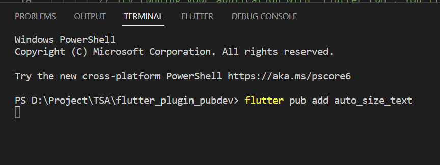
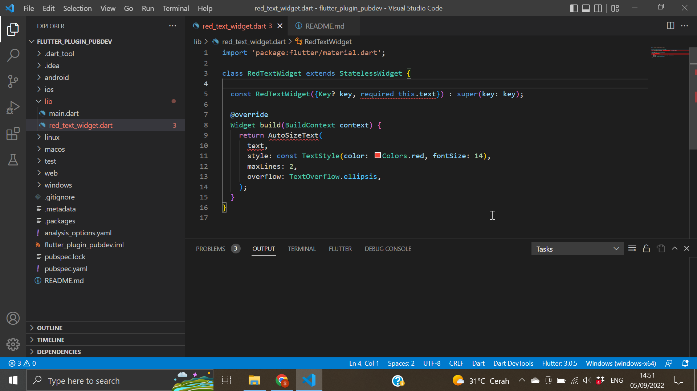
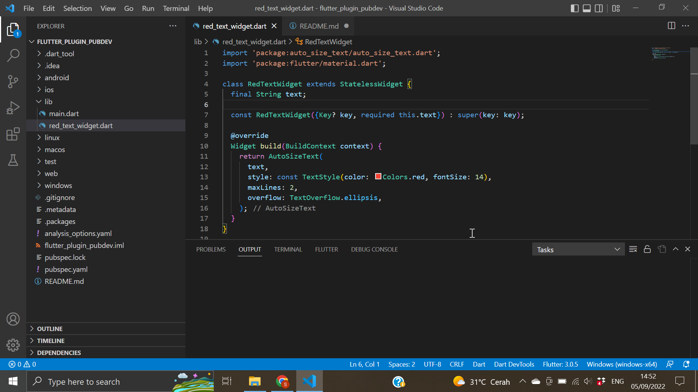
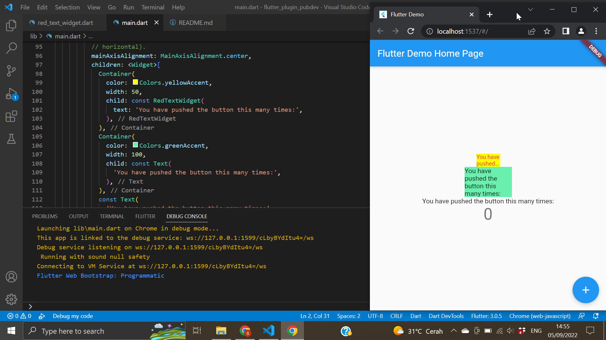

# flutter_plugin_pubdev

A new Flutter project.

# Praktikum 

## Langkah 1: Buat Project Baru
## Langkah 2: Menambahkan Plugin

## Langkah 3: Buat file red_text_widget.dart
## Langkah 4: Tambah Widget AutoSizeText

Setelah Anda menambahkan kode di atas, Anda akan mendapatkan info error. Mengapa demikian? Jelaskan dalam laporan praktikum Anda!

- Pada kode di atas terdapat error karena belum ada import package auto_size_text dan karena belum ada variabel text yang dideklarasikan

## Langkah 5: Buat Variabel text dan parameter di constructor

## Langkah 6: Tambahkan widget di main.dart

# Pertanyaan 

1. Selesaikan Praktikum tersebut, lalu dokumentasikan dan push ke repository Anda berupa screenshot hasil pekerjaan beserta penjelasannya di file README.md!
2. Jelaskan maksud dari langkah 2 pada praktikum tersebut!
- Langkah kedua merupakan cara untuk menambahkan plugin auto_size_text ke dalam project. Selanjutnya, akan didownload package tersebut.
3. Jelaskan maksud dari langkah 5 pada praktikum tersebut!
- Karena pada kode program di red_twxt_widget kita menggunakan variabel text untuk menampilkan text, maka nilai variabel text perlu didefinisikan dan ditambahkan di konstruktor.
4. Pada langkah 6 terdapat dua widget yang ditambahkan, jelaskan fungsi dan perbedaannya!
- Pada container pertama, kita menggunakan auto_size_text dengan memanggil class RedTextWidget. Sementara pada container kedua menggunakan widget Text biasa.
5. Jelaskan maksud dari tiap parameter yang ada di dalam plugin auto_size_text berdasarkan tautan pada dokumentasi ini !
- text merupakan kalimat yang akan ditampilkan
style : berisi style atau pengaturan tampilan seperti warna fontsize
maxLines : merupakan batas maksimal baris dari text yang ditampilkan
overflow : merupakan teks yang akan ditampilkan ketika nilai text terlalu panjang. Misalnya pada kode kita menggunakan ellipsis (...)